# System Architecture

Technical architecture and design decisions for the 5GLab Booking System.

## Overview

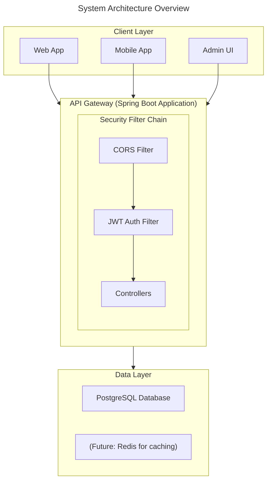

## Authentication Flow

### Login Flow

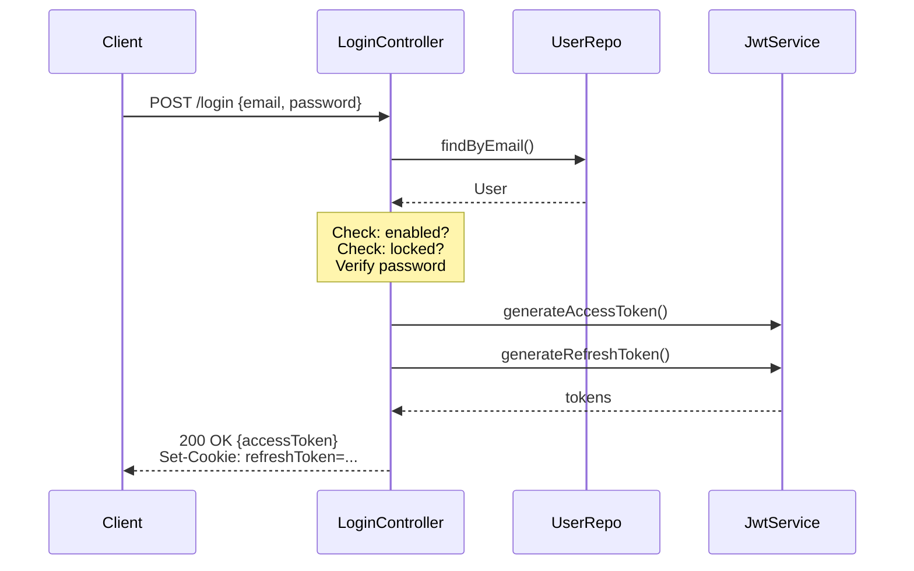

### Token Refresh Flow

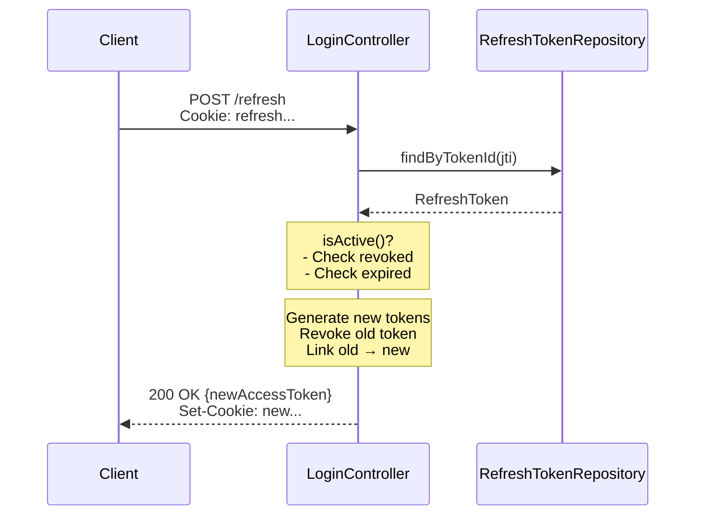

### MFA Login Flow

When MFA is enabled for a user:

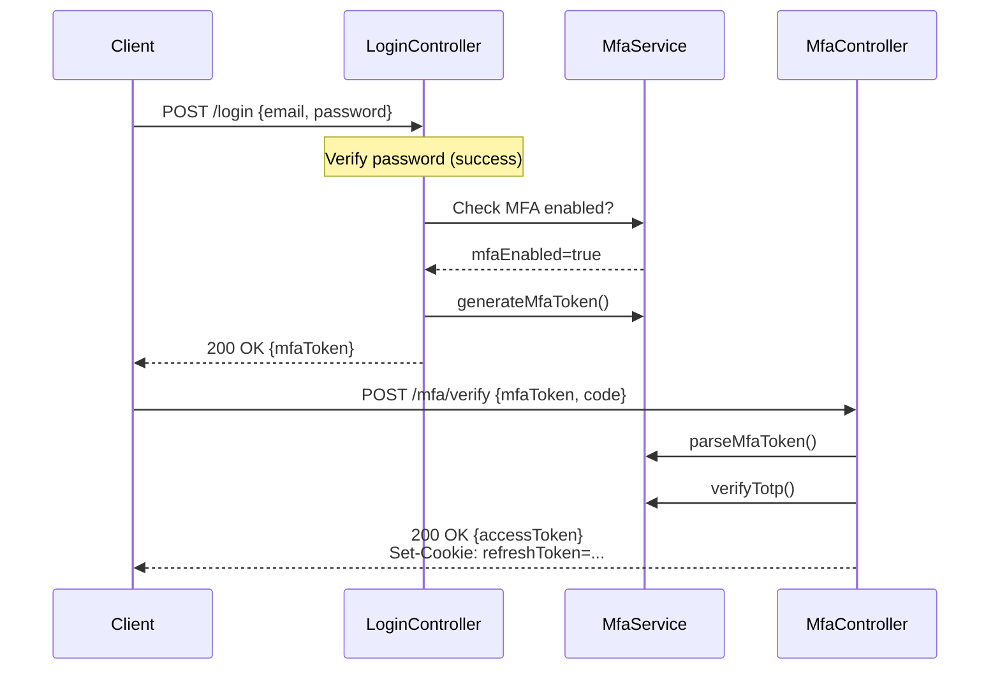

### MFA Setup Flow

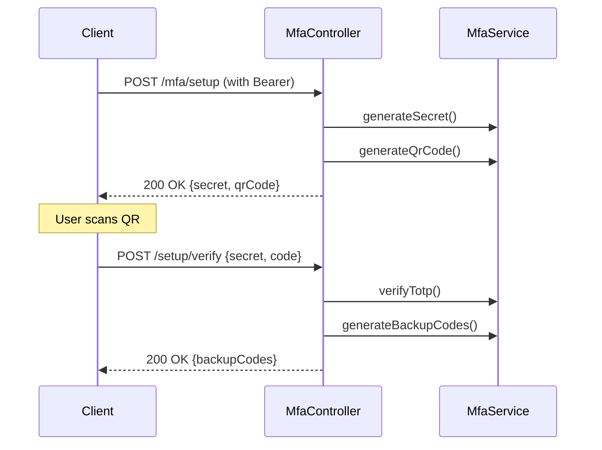

### User Registration Flow (Admin Only)

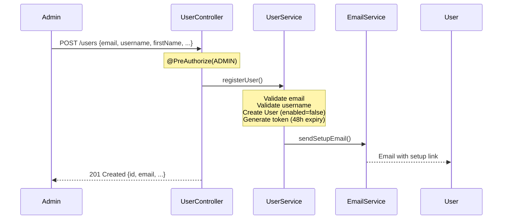

### Token Reuse Detection

When a refresh token is used after it has been rotated:

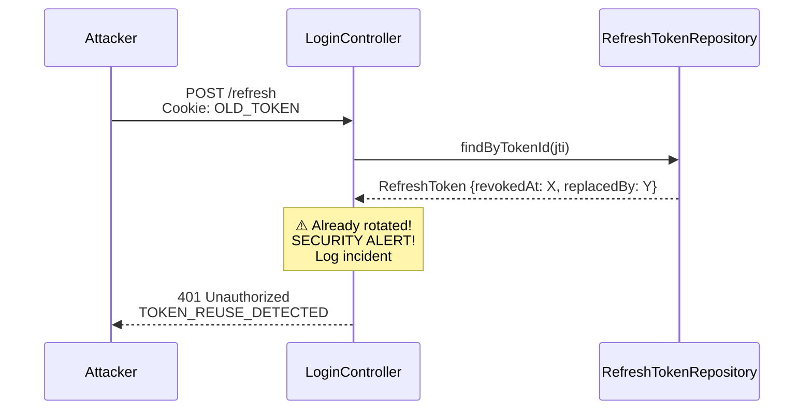

## Database Schema

### User & Authentication Entities

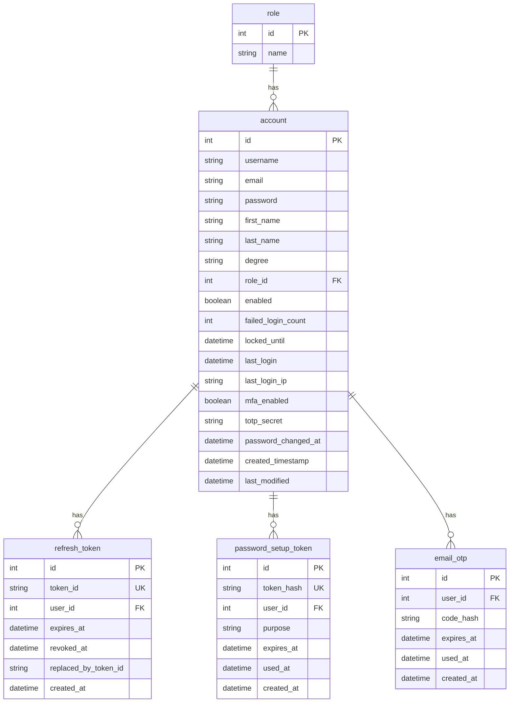

### Booking Entities

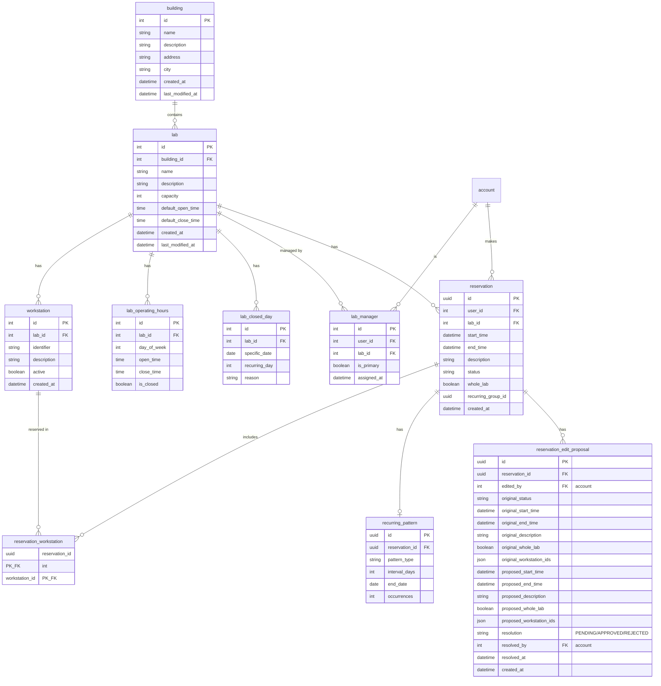

### Booking Enums

```java
public enum ReservationStatus {
    PENDING,               // Awaiting lab manager review
    APPROVED,              // Approved by lab manager
    REJECTED,              // Rejected by lab manager
    CANCELLED,             // Cancelled by user
    PENDING_EDIT_APPROVAL  // Edited, awaiting approval
}

public enum RecurrenceType {
    WEEKLY,     // Every week
    BIWEEKLY,   // Every two weeks
    MONTHLY,    // Monthly on same day
    CUSTOM      // Every N days (intervalDays)
}
```

## Security Architecture

### JWT Token Structure

#### Access Token Claims

```json
{
  "sub": "user@example.com",
  "userId": 1,
  "role": "PROFESSOR",
  "iat": 1703836800,
  "exp": 1703837700,
  "iss": "booking-system"
}
```

#### Refresh Token Claims

```json
{
  "sub": "user@example.com",
  "jti": "550e8400-e29b-41d4-a716-446655440000",
  "iat": 1703836800,
  "exp": 1704441600,
  "iss": "booking-system"
}
```

### Key Management

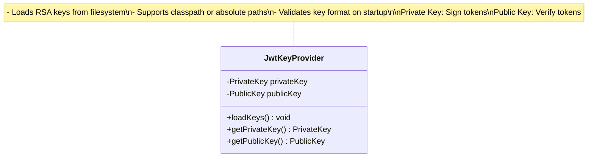

### Security Filter Chain

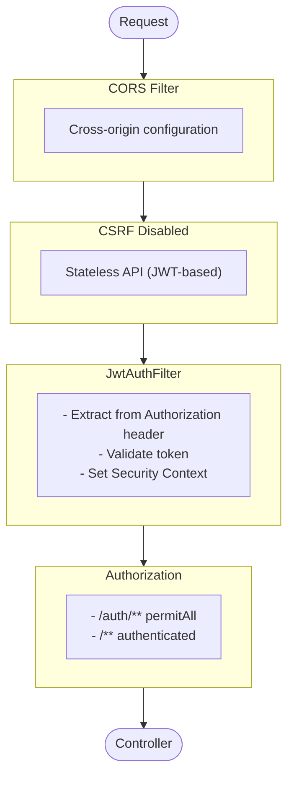

## Lockout Policy Implementation

### Tiered Lockout Logic

```java
// Pseudocode
if (passwordMismatch) {
    failedCount++;
    
    if (failedCount >= 6) {
        lockUntil = now + 30 minutes;
    } else if (failedCount >= 3) {
        lockUntil = now + 10 minutes;
    }
}

if (successfulLogin) {
    failedCount = 0;
    lockUntil = null;
}
```

### State Diagram

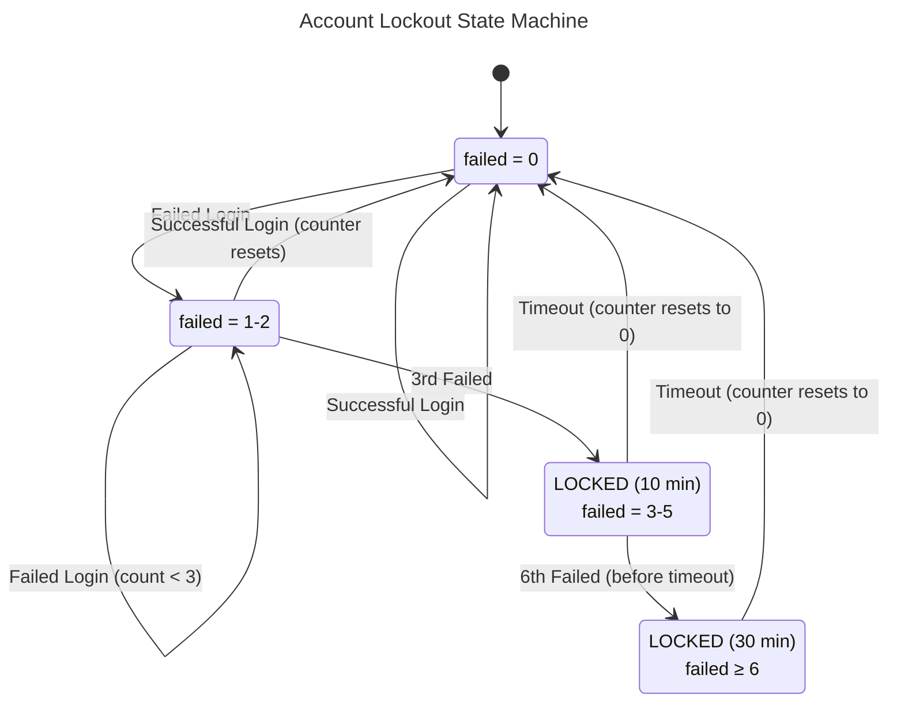

## Module Structure

```
com._glab.booking_system
│
├── auth/                          # Authentication Module
│   ├── config/
│   │   ├── JwtKeyProvider        # RSA key management
│   │   ├── JwtProperties         # JWT configuration
│   │   ├── AppProperties         # App-wide config (mail, frontend URL)
│   │   └── SecurityConfig        # Spring Security config
│   │
│   ├── controller/
│   │   ├── LoginController       # Login/refresh/logout endpoints
│   │   └── MfaController         # MFA setup/verify endpoints
│   │
│   ├── exception/
│   │   ├── AuthenticationFailedException
│   │   ├── AccountLockedException
│   │   ├── AccountDisabledException
│   │   ├── InvalidRefreshTokenException
│   │   ├── RefreshTokenExpiredException
│   │   ├── RefreshTokenReuseException
│   │   ├── InvalidPasswordSetupTokenException
│   │   ├── ExpiredPasswordSetupTokenException
│   │   ├── MfaRequiredException
│   │   ├── MfaSetupRequiredException
│   │   ├── InvalidMfaCodeException
│   │   ├── InvalidMfaTokenException
│   │   ├── MfaTokenExpiredException
│   │   ├── MfaRateLimitedException
│   │   ├── MfaAlreadyEnabledException
│   │   ├── MfaNotEnabledException
│   │   └── MfaVerificationFailedException
│   │
│   ├── filter/
│   │   └── JwtAuthenticationFilter
│   │
│   ├── model/
│   │   ├── RefreshToken          # Refresh token entity
│   │   ├── PasswordSetupToken    # Password setup entity
│   │   ├── EmailOtp              # Email OTP entity
│   │   ├── TokenPurpose          # ACCOUNT_SETUP, PASSWORD_RESET
│   │   └── MfaCodeType           # TOTP, EMAIL, BACKUP
│   │
│   ├── repository/
│   │   ├── RefreshTokenRepository
│   │   ├── PasswordSetupTokenRepository
│   │   └── EmailOtpRepository
│   │
│   ├── request/
│   │   ├── LoginRequest
│   │   ├── SetupPasswordRequest
│   │   ├── MfaVerifyRequest
│   │   ├── MfaSetupVerifyRequest
│   │   └── MfaDisableRequest
│   │
│   ├── response/
│   │   ├── LoginResponse
│   │   ├── MfaChallengeResponse
│   │   ├── MfaSetupResponse
│   │   └── MfaSetupCompleteResponse
│   │
│   └── service/
│       ├── JwtService            # Token generation/validation
│       ├── PasswordSetupTokenService
│       ├── MfaService            # TOTP, backup codes, MFA tokens
│       ├── EmailOtpService       # Email OTP generation/verification
│       ├── EmailService          # Centralized email sending
│       └── CustomUserDetailsService
│
├── admin/                         # Admin Module
│   ├── controller/
│   │   └── LogController         # Log access endpoints
│   │
│   ├── response/
│   │   └── LogEntryResponse      # Log entry DTO
│   │
│   └── service/
│       └── LogService            # Log file parsing and filtering
│
├── user/                          # User Module
│   ├── controller/
│   │   ├── UserController        # User profile and admin registration
│   │   └── AdminUserController   # Admin user management
│   │
│   ├── exception/
│   │   ├── UserAlreadyExistsException
│   │   ├── UsernameAlreadyExistsException
│   │   └── InvalidRoleException
│   │
│   ├── model/
│   │   ├── User                  # User entity (with MFA fields)
│   │   ├── Role                  # Role entity
│   │   ├── RoleName              # ADMIN, LAB_MANAGER, PROFESSOR
│   │   └── Degree                # Academic degree enum
│   │
│   ├── repository/
│   │   ├── UserRepository
│   │   └── RoleRepository
│   │
│   ├── request/
│   │   └── CreateUserRequest     # Admin registration request
│   │
│   ├── response/
│   │   └── UserResponse          # User info response
│   │
│   └── service/
│       └── UserService           # User registration logic
│
├── booking/                       # Lab Booking Module
│   ├── controller/
│   │   ├── BuildingController         # Building discovery endpoints
│   │   ├── LabController              # Lab details & availability
│   │   ├── ReservationController      # Reservation CRUD & professor edits
│   │   ├── LabManagerReservationController  # Lab manager reservation management
│   │   ├── LabManagerController       # Lab manager lab operations
│   │   ├── AdminBuildingController    # Admin building CRUD
│   │   ├── AdminLabController         # Admin lab CRUD & manager assignment
│   │   ├── AdminWorkstationController # Admin workstation CRUD
│   │   ├── AdminDaysOffController     # University-wide days off
│   │   └── AdminReservationController # Admin reservation management
│   │
│   ├── exception/
│   │   ├── LabNotFoundException
│   │   ├── BuildingNotFoundException
│   │   ├── WorkstationNotFoundException
│   │   ├── ReservationNotFoundException
│   │   ├── InvalidReservationTimeException
│   │   ├── OutsideOperatingHoursException
│   │   ├── LabClosedException
│   │   ├── WorkstationNotInLabException
│   │   ├── WorkstationInactiveException
│   │   ├── NoWorkstationsSelectedException
│   │   ├── InvalidRecurringPatternException
│   │   ├── NoValidOccurrencesException
│   │   └── BookingNotAuthorizedException
│   │
│   ├── exception_handler/
│   │   └── BookingExceptionHandler  # Booking-specific error handling
│   │
│   ├── model/
│   │   ├── Building              # Building entity
│   │   ├── BuildingOperatingHours# Building per-day operating hours
│   │   ├── BuildingClosedDay     # Building-specific closure dates
│   │   ├── Lab                   # Lab entity
│   │   ├── Workstation           # Individual workstation
│   │   ├── LabManager            # User-Lab management junction
│   │   ├── LabOperatingHours     # Lab per-day operating hours
│   │   ├── LabClosedDay          # Lab-specific closure dates
│   │   ├── SpecialOperatingHours # Date-specific operating hour overrides
│   │   ├── Reservation           # Booking request
│   │   ├── ReservationWorkstation# Reservation-Workstation junction
│   │   ├── RecurringPattern      # Recurrence configuration
│   │   ├── ReservationEditProposal # Stores original/proposed values for edits
│   │   ├── ReservationStatus     # PENDING/APPROVED/REJECTED/CANCELLED/PENDING_EDIT_APPROVAL
│   │   └── RecurrenceType        # WEEKLY/BIWEEKLY/MONTHLY/CUSTOM
│   │
│   ├── repository/
│   │   ├── BuildingRepository
│   │   ├── BuildingOperatingHoursRepository
│   │   ├── BuildingClosedDayRepository
│   │   ├── LabRepository
│   │   ├── WorkstationRepository
│   │   ├── LabManagerRepository
│   │   ├── LabOperatingHoursRepository
│   │   ├── LabClosedDayRepository
│   │   ├── SpecialOperatingHoursRepository
│   │   ├── ReservationRepository
│   │   ├── RecurringPatternRepository
│   │   └── ReservationEditProposalRepository
│   │
│   ├── request/
│   │   └── CreateReservationRequest  # Reservation creation DTO
│   │
│   ├── response/
│   │   ├── LabAvailabilityResponse   # Weekly availability grid
│   │   ├── CurrentAvailabilityResponse
│   │   ├── LabWorkstationsResponse
│   │   ├── ReservationResponse
│   │   ├── RecurringReservationResponse
│   │   ├── ReservationSummaryResponse
│   │   ├── OperatingHoursResponse
│   │   ├── ClosedDayResponse
│   │   └── WorkstationResponse
│   │
│   └── service/
│       ├── BuildingService            # Building CRUD & operating hours
│       ├── LabService                 # Lab CRUD, managers & operating hours
│       ├── WorkstationService         # Workstation CRUD
│       ├── DaysOffService             # University-wide days off management
│       ├── AvailabilityService        # Availability calculations
│       ├── ReservationService         # Reservation creation & validation
│       ├── ReservationManagementService # Approve/decline reservations
│       ├── ReservationEditService     # Edit proposal workflow
│       └── LabManagerAuthorizationService # Authorization checks
│
├── ErrorResponse                  # Global error format
├── ErrorResponseCode              # Error code enum
└── BookingSystemApplication       # Main class
```

## Configuration Management

### Profile-Based Configuration

| Profile | Purpose | Database | JWT Keys |
|---------|---------|----------|----------|
| `default` | Production | External PostgreSQL | File-based |
| `dev` | Development | Docker PostgreSQL | File-based |
| `test` | Testing | Testcontainers | Generated in-memory |

### Configuration Hierarchy

```
application.yml          # Base configuration
    │
    ├── application-dev.yml     # Development overrides
    │
    └── application-test.yml    # Test overrides
```

## Logging Strategy

### Security Audit Logs

All authentication events are logged with severity levels:

| Event | Level | Information Logged |
|-------|-------|-------------------|
| Successful login | INFO | Email, IP |
| Failed login | WARN | Email, IP, attempt count |
| Account locked | WARN | Email, IP, duration |
| Token refresh | DEBUG | Email, IP |
| Token reuse detected | ERROR | Email, IP (security incident) |
| Logout | INFO | Email, IP |
| MFA setup initiated | INFO | Email |
| MFA enabled | INFO | Email |
| MFA verification success | INFO | Email, IP |
| MFA verification failed | WARN | Email, IP, code type |
| Invalid MFA token | WARN | IP |
| Email OTP sent | INFO | Email |
| Email OTP rate limited | DEBUG | Email |
| MFA disabled | INFO | Email |
| Backup code used | INFO | Email |

### Log Format

```
2024-01-01T12:00:00.000Z  WARN 12345 --- [http-nio-8080-exec-1] c._g.b.auth.controller.LoginController : Account user@example.com locked for 10 minutes after 3 failed attempts from IP 192.168.1.100
```

## MFA Implementation

### Overview

Multi-Factor Authentication is implemented with three verification methods:

| Method | Description | Use Case |
|--------|-------------|----------|
| **TOTP** | 6-digit code from authenticator app (Google Authenticator, Authy) | Primary MFA method |
| **Email OTP** | 6-digit code sent via email | Fallback when TOTP unavailable |
| **Backup Codes** | 10 one-time codes (e.g., "ABCD-1234") | Emergency access when other methods fail |

### Role-Based MFA Enforcement

| Role | MFA Required | Can Disable |
|------|--------------|-------------|
| ADMIN | ✅ Mandatory | ❌ No |
| LAB_MANAGER | ✅ Mandatory | ❌ No |
| PROFESSOR | ❌ Optional | ✅ Yes |

### MFA Token

A short-lived JWT (5 minutes) issued after password verification:

```json
{
  "sub": "user@example.com",
  "userId": 1,
  "mfaPending": true,
  "jti": "uuid",
  "exp": "now + 5 min",
  "iss": "booking-system-mfa"
}
```

### Backup Codes

- 10 codes generated on MFA setup
- Format: `XXXX-XXXX` (alphanumeric, excluding similar chars like 0/O, 1/I)
- Stored as BCrypt hashes
- Each code can only be used once

---

## Lab Booking System Design

### Key Design Decisions

1. **No Hard Blocking**: Neither APPROVED nor PENDING reservations block workstation selection. Users can always select any workstation - the API returns reservation data so the frontend can visually warn users about conflicts. Lab managers make the final approval decision.

2. **Recurring Reservations**: Each occurrence is a separate `Reservation` row linked by `recurring_group_id` (UUID). This allows individual occurrence management (edit/cancel one without affecting others).

3. **Lab Managers**: Many-to-many relationship via `LabManager` table with `is_primary` flag. Multiple users can manage a single lab. Admins can approve any lab as fallback.

4. **Operating Hours**: Stored per day-of-week per lab in `LabOperatingHours`. Default hours (8:00-20:00 weekdays) applied at lab creation. Sundays closed by default via `LabClosedDay`.

5. **Availability Response**: Returns standard JSON with arrays of reservations, operating hours, and closed days. Frontend handles rendering and conflict visualization.

### Booking Flow

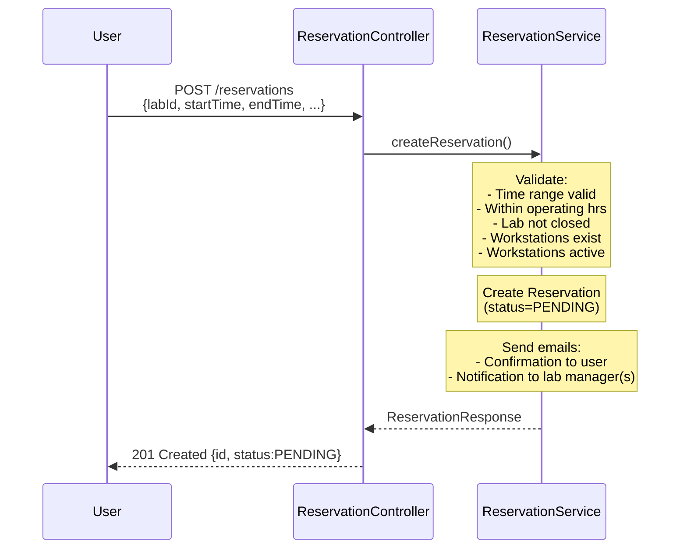

### Recurring Reservation Flow

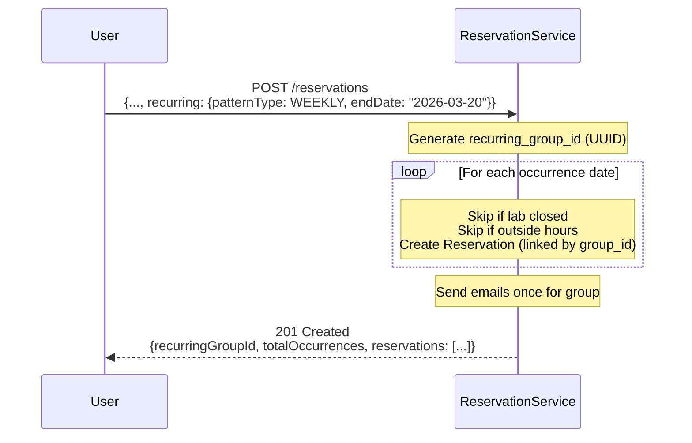

---

## Future Considerations

### Planned Enhancements

1. **Rate Limiting**
   - Redis-based rate limiting per IP/user
   - Configurable thresholds

2. **GeoIP Analysis**
   - IP geolocation for login anomaly detection
   - Suspicious location alerts

3. **Session Management**
   - Concurrent session limits
   - Session listing and remote logout

4. **Password Policies**
   - Minimum complexity requirements
   - Password history (prevent reuse)
   - Expiration policies

### Scalability Considerations

- **Horizontal Scaling**: Stateless JWT design allows multiple app instances
- **Database Scaling**: Read replicas for token validation
- **Caching**: Redis for frequently accessed user data
- **Token Storage**: Consider moving refresh tokens to Redis for faster lookups

