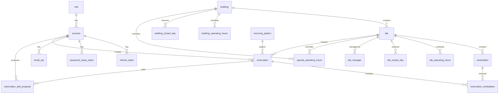

# Database Schema

This document describes the database schema for the 5G Lab Booking System.

## Entity Relationship Diagram (Overview)

This diagram shows all entities and their relationships. For column details, see the tables below.

---

## Table Details

### User Domain

#### account

| Column | Type | Constraints | Description |
|--------|------|-------------|-------------|
| id | INTEGER | PK | Auto-generated |
| username | VARCHAR | UNIQUE | Login username |
| password | VARCHAR | | BCrypt hash |
| email | VARCHAR | | Email address |
| firstName | VARCHAR | | |
| lastName | VARCHAR | | |
| degree | ENUM | | INZ, MGR, MGR_INZ, DR, DR_INZ, DR_HAB, PROF |
| role_id | INTEGER | FK → role | |
| lastLogin | TIMESTAMP | | |
| lastLoginIp | VARCHAR(45) | | IPv4/IPv6 |
| enabled | BOOLEAN | | Default: true |
| archivedAt | TIMESTAMP | | Soft-delete timestamp |
| isAnonymous | BOOLEAN | | System placeholder for deleted users |
| failedLoginCount | INTEGER | | Default: 0 |
| lockedUntil | TIMESTAMP | | Account lockout |
| mfaEnabled | BOOLEAN | | Default: false |
| totpSecret | VARCHAR(128) | | TOTP secret key |
| mfaEnforcedAt | TIMESTAMP | | When MFA was enforced |
| backupCodes | TEXT | | JSON array of BCrypt hashes |
| passwordChangedAt | TIMESTAMP | | |
| createdTimestamp | TIMESTAMP | | Auto |
| lastModifiedTimestamp | TIMESTAMP | | Auto |

#### role

| Column | Type | Constraints | Description |
|--------|------|-------------|-------------|
| id | INTEGER | PK | |
| name | ENUM | UNIQUE, NOT NULL | ADMIN, LAB_MANAGER, PROFESSOR |
| description | VARCHAR(255) | | |
| createdTimestamp | TIMESTAMP | | |
| lastModifiedTimestamp | TIMESTAMP | | |

---

### Building Domain

#### building

| Column | Type | Constraints | Description |
|--------|------|-------------|-------------|
| id | INTEGER | PK | |
| name | VARCHAR | NOT NULL | |
| description | VARCHAR | | |
| address | VARCHAR | | |
| city | VARCHAR | | |
| active | BOOLEAN | NOT NULL | Default: true |
| archivedAt | TIMESTAMP | | Soft-delete |
| created_at | TIMESTAMP | | |
| last_modified_at | TIMESTAMP | | |

#### building_operating_hours

| Column | Type | Constraints | Description |
|--------|------|-------------|-------------|
| id | INTEGER | PK | |
| building_id | INTEGER | FK, NOT NULL | |
| day_of_week | INTEGER | NOT NULL | 0=Sun, 1=Mon, ..., 6=Sat |
| open_time | TIME | | |
| close_time | TIME | | |
| is_closed | BOOLEAN | | Default: false |

**Unique**: (building_id, day_of_week)

#### building_closed_day

| Column | Type | Constraints | Description |
|--------|------|-------------|-------------|
| id | INTEGER | PK | |
| building_id | INTEGER | FK, NOT NULL | |
| specific_date | DATE | | One-time closure |
| recurring_day_of_week | INTEGER | | Recurring closure (0-6) |
| reason | VARCHAR | | e.g., "Holiday" |

---

### Lab Domain

#### lab

| Column | Type | Constraints | Description |
|--------|------|-------------|-------------|
| id | INTEGER | PK | |
| building_id | INTEGER | FK, NOT NULL | |
| name | VARCHAR | NOT NULL | |
| description | VARCHAR | | |
| capacity | INTEGER | | |
| default_open_time | TIME | | |
| default_close_time | TIME | | |
| active | BOOLEAN | NOT NULL | Default: true |
| archivedAt | TIMESTAMP | | |
| created_at | TIMESTAMP | | |
| last_modified_at | TIMESTAMP | | |

#### lab_operating_hours

| Column | Type | Constraints | Description |
|--------|------|-------------|-------------|
| id | INTEGER | PK | |
| lab_id | INTEGER | FK, NOT NULL | |
| day_of_week | INTEGER | NOT NULL | 0=Sun to 6=Sat |
| open_time | TIME | | |
| close_time | TIME | | |
| is_closed | BOOLEAN | | Default: false |

**Unique**: (lab_id, day_of_week)

#### lab_closed_day

| Column | Type | Constraints | Description |
|--------|------|-------------|-------------|
| id | INTEGER | PK | |
| lab_id | INTEGER | FK | Nullable = global closure |
| specific_date | DATE | | |
| recurring_day_of_week | INTEGER | | |
| reason | VARCHAR | | |

#### special_operating_hours

| Column | Type | Constraints | Description |
|--------|------|-------------|-------------|
| id | INTEGER | PK | |
| lab_id | INTEGER | FK | Nullable |
| building_id | INTEGER | FK | Nullable |
| specific_date | DATE | NOT NULL | |
| open_time | TIME | | |
| close_time | TIME | | |
| is_closed | BOOLEAN | | Default: false |

#### workstation

| Column | Type | Constraints | Description |
|--------|------|-------------|-------------|
| id | INTEGER | PK | |
| lab_id | INTEGER | FK, NOT NULL | |
| identifier | VARCHAR(20) | NOT NULL | e.g., "WS-01", "A1" |
| description | VARCHAR | | |
| active | BOOLEAN | NOT NULL | Default: true |
| created_at | TIMESTAMP | | |
| last_modified_at | TIMESTAMP | | |

**Unique**: (lab_id, identifier)

#### lab_manager

| Column | Type | Constraints | Description |
|--------|------|-------------|-------------|
| id | INTEGER | PK | |
| user_id | INTEGER | FK, NOT NULL | |
| lab_id | INTEGER | FK, NOT NULL | |
| is_primary | BOOLEAN | | Default: false |
| assigned_at | TIMESTAMP | | |

**Unique**: (user_id, lab_id)

---

### Reservation Domain

#### reservation

| Column | Type | Constraints | Description |
|--------|------|-------------|-------------|
| id | UUID | PK | |
| lab_id | INTEGER | FK, NOT NULL | |
| user_id | INTEGER | FK, NOT NULL | |
| start_time | TIMESTAMP | NOT NULL | |
| end_time | TIMESTAMP | NOT NULL | |
| description | TEXT | | |
| status | ENUM | NOT NULL | PENDING, APPROVED, REJECTED, CANCELLED, PENDING_EDIT_APPROVAL |
| whole_lab | BOOLEAN | | Default: false |
| recurring_group_id | UUID | | Links recurring instances |
| created_at | TIMESTAMP | | |
| last_modified_at | TIMESTAMP | | |

**Indexes**: (lab_id, start_time, end_time), (user_id), (recurring_group_id)

#### reservation_workstation

| Column | Type | Constraints | Description |
|--------|------|-------------|-------------|
| id | INTEGER | PK | |
| reservation_id | UUID | FK, NOT NULL | |
| workstation_id | INTEGER | FK, NOT NULL | |

**Unique**: (reservation_id, workstation_id)

#### reservation_edit_proposal

| Column | Type | Constraints | Description |
|--------|------|-------------|-------------|
| id | UUID | PK | |
| reservation_id | UUID | FK, NOT NULL | |
| edited_by | INTEGER | FK, NOT NULL | User who proposed |
| original_status | ENUM | NOT NULL | |
| original_start_time | TIMESTAMP | NOT NULL | |
| original_end_time | TIMESTAMP | NOT NULL | |
| original_description | TEXT | | |
| original_whole_lab | BOOLEAN | NOT NULL | |
| original_workstation_ids | TEXT | | JSON array |
| proposed_start_time | TIMESTAMP | NOT NULL | |
| proposed_end_time | TIMESTAMP | NOT NULL | |
| proposed_description | TEXT | | |
| proposed_whole_lab | BOOLEAN | NOT NULL | |
| proposed_workstation_ids | TEXT | | JSON array |
| created_at | TIMESTAMP | | |
| resolved_at | TIMESTAMP | | |
| resolved_by | INTEGER | FK | User who resolved |
| resolution | ENUM | NOT NULL | PENDING, APPROVED, REJECTED |

#### recurring_pattern

| Column | Type | Constraints | Description |
|--------|------|-------------|-------------|
| id | UUID | PK | |
| recurring_group_id | UUID | UNIQUE, NOT NULL | Links to reservation.recurring_group_id |
| pattern_type | ENUM | NOT NULL | WEEKLY, BIWEEKLY, MONTHLY, CUSTOM |
| interval_days | INTEGER | | For CUSTOM pattern |
| end_date | DATE | | Series end date |
| occurrences | INTEGER | | Number of occurrences |

---

### Auth Domain

#### refresh_token

| Column | Type | Constraints | Description |
|--------|------|-------------|-------------|
| id | UUID | PK | |
| user_id | INTEGER | FK, NOT NULL | |
| tokenId | VARCHAR(64) | UNIQUE, NOT NULL | JWT jti claim |
| expiresAt | TIMESTAMP | NOT NULL | |
| revokedAt | TIMESTAMP | | When revoked |
| replacedByTokenId | VARCHAR(64) | | Rotation chain |
| created_at | TIMESTAMP | | |

#### password_setup_token

| Column | Type | Constraints | Description |
|--------|------|-------------|-------------|
| id | UUID | PK | |
| user_id | INTEGER | FK, NOT NULL | |
| tokenHash | VARCHAR(64) | UNIQUE, NOT NULL | SHA-256 hash |
| expiresAt | TIMESTAMP | NOT NULL | |
| usedAt | TIMESTAMP | | |
| purpose | ENUM | NOT NULL | ACCOUNT_SETUP, PASSWORD_RESET |
| created_at | TIMESTAMP | | |

#### email_otp

| Column | Type | Constraints | Description |
|--------|------|-------------|-------------|
| id | UUID | PK | |
| user_id | INTEGER | FK, NOT NULL | |
| codeHash | VARCHAR(64) | NOT NULL | SHA-256 hash |
| expiresAt | TIMESTAMP | NOT NULL | 10-min expiry |
| usedAt | TIMESTAMP | | |
| created_at | TIMESTAMP | | |

---

## Enums Reference

| Enum | Values |
|------|--------|
| RoleName | `ADMIN`, `LAB_MANAGER`, `PROFESSOR` |
| Degree | `INZ`, `MGR`, `MGR_INZ`, `DR`, `DR_INZ`, `DR_HAB`, `PROF` |
| ReservationStatus | `PENDING`, `APPROVED`, `REJECTED`, `CANCELLED`, `PENDING_EDIT_APPROVAL` |
| ResolutionStatus | `PENDING`, `APPROVED`, `REJECTED` |
| RecurrenceType | `WEEKLY`, `BIWEEKLY`, `MONTHLY`, `CUSTOM` |
| TokenPurpose | `ACCOUNT_SETUP`, `PASSWORD_RESET` |

---

## Index Summary

| Table | Index Name | Columns | Unique |
|-------|------------|---------|--------|
| reservation | idx_reservation_lab_time | lab_id, start_time, end_time | No |
| reservation | idx_reservation_user | user_id | No |
| reservation | idx_reservation_recurring_group | recurring_group_id | No |
| reservation_edit_proposal | idx_edit_proposal_reservation | reservation_id | No |
| reservation_edit_proposal | idx_edit_proposal_resolution | resolution | No |
| recurring_pattern | idx_recurring_pattern_group | recurring_group_id | Yes |
| lab_closed_day | idx_lab_closed_day_lab | lab_id | No |
| lab_closed_day | idx_lab_closed_day_date | specific_date | No |
| building_closed_day | idx_building_closed_day_building | building_id | No |
| building_closed_day | idx_building_closed_day_date | specific_date | No |
| special_operating_hours | idx_special_operating_lab_date | lab_id, specific_date | No |
| special_operating_hours | idx_special_operating_building_date | building_id, specific_date | No |
| refresh_token | idx_refresh_token_jti | tokenId | Yes |
| password_setup_token | idx_password_setup_token_hash | tokenHash | Yes |
| email_otp | idx_email_otp_user | user_id | No |
| email_otp | idx_email_otp_hash | codeHash | No |
